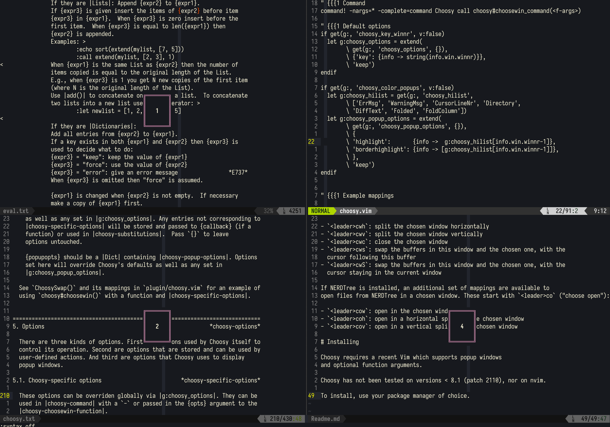
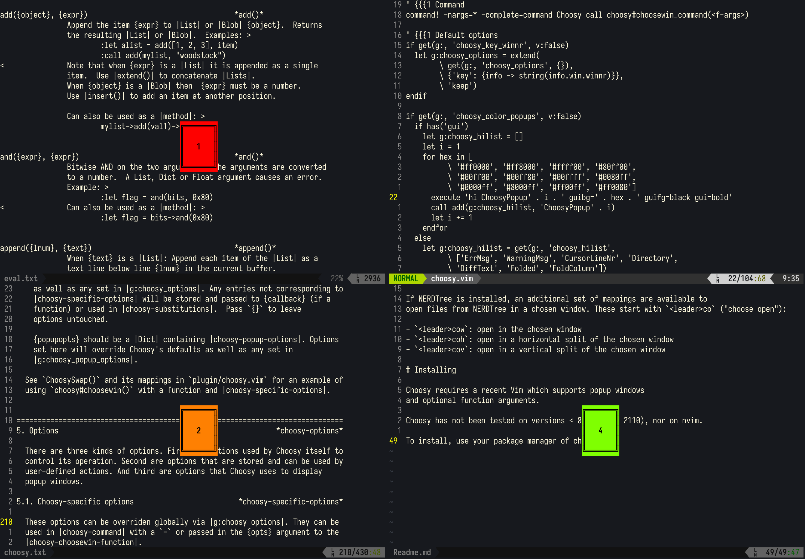

# Introduction

 Choosy is a Vim plugin for quickly preforming actions on windows via a interactive selection mechanism. Vim typically operates with a [verb-object](https://stackoverflow.com/questions/1218390/what-is-your-most-productive-shortcut-with-vim/1220118#1220118) syntax, and Choosy does the same. For example, you might type `<leader>cwc` (verb: <b>c</b>hoose <b>w</b>indow to <b>c</b>lose) then pick the window you want to close (the object, or target).

Choosy was inspired by [vim-choosewin](https://github.com/t9md/vim-choosewin) but is more configurable, allowing the user to specify the actions to take on the target window.

## Features

When run, Choosy displays a popup at the center of each window. Each popup shows a letter or the window number (configurable). To choose the window, type the given letter/number. Choosy closes all of the popups it opened and executes an action.

What actions? Pretty much anything you like. Choosy comes with a number of example actions (see below) such as jumping to a window, splitting a window, closing a window, or swapping buffers between windows. But part of the power of Choosy is that you can easily set up your own actions. Here's an example call to Choosy that splits a selected window into 3 parts:

```vim
nnoremap <leader>3 :Choosy call win_execute({win.winid}, "sp {bar} sp")<cr>
```

The `{win.winid}` gets replaced with the window ID of the window you chose, and the `{bar}` gets replacded with the `|` command separator. See [the docs](doc/choosy.txt) for full information, or [plugin/choosy.vim](plugin/choosy.vim) for more examples.

## Default mappings

Choosy comes with a set of default mappings starting with `<leader>cw` ("<b>c</b>hoose <b>w</b>indow"):

- `<leader>cwh`: split the target window <b>h</b>orizontally
- `<leader>cwv`: split the target window <b>v</b>ertically
- `<leader>cwc`: <b>c</b>lose the target window
- `<leader>cws`: <b>s</b>wap the buffers in this window and the target one, with the cursor following this buffer
- `<leader>cwS`: swap the buffers in this window and the target one, with the cursor <b>S</b>taying in the current window
- `<leader>cwD`: show this buffer in the target window ("<b>D</b>uplicate")

If NERDTree is installed, an additional set of mappings are available to open files from NERDTree in a target window. These start with `<leader>co` ("<b>c</b>hoose <b>o</b>pen"):

- `<leader>cow`: open in the target <b>w</b>indow
- `<leader>coh`: open in a <b>h</b>orizontal split of the target window
- `<leader>cov`: open in a <b>v</b>ertical split of the target window   

# Installing

Choosy requires a recent Vim which supports popup windows
and optional function arguments.

Choosy has not been tested on versions < 8.1 (patch 2110), nor on nvim.

To install, use your package manager of choice. For example, with
[vim-plug](https://github.com/junegunn/vim-plug) add to your `vimrc`:

```vim
Plug 'anjiro/vim-choosy'
```

# Screenshots

Note that these screenshots have syntax higlighting turned off to make the Choosy popups more visible.

Basic configuration:



With `g:choosy_color_popups` and `g:choosy_key_winnr` set:


